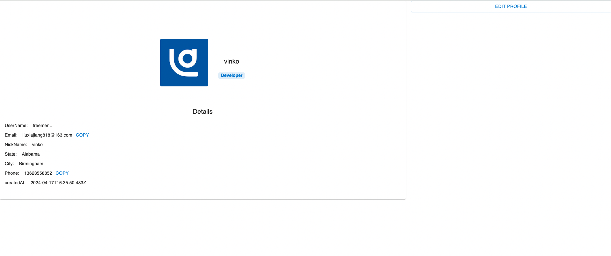
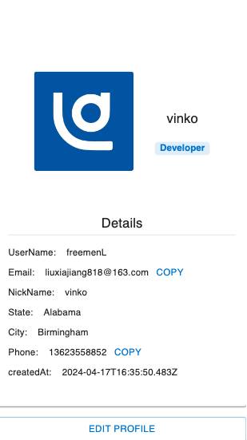

#  Coding Test - Profile 

### pc端效果图


### 移动端效果图


### 项目介绍:

```Profile 展示```

```已完成功能:```
  1. Profile 展示
-  显示用户信息( UserName ,Email, userImage, NickName,State,City,Phone,createdAt) 
  2.  Profile 编辑
- 编辑用户信息( UserName ,Email, NickName,State,City,Phone)
  （注: UserName , Email 设置了默认不可更改, Phone添加了校验 ）

```规划中未完成:```

1. 头像上传功能 可接入(七牛云/阿里云 )的对象存储服务实现
2. 用户背景图上传/展示功能
3. 修改用户信息功能中的地址选择采用merta-ui的AutoComplete组件实现下模糊搜索

### 运行环境:

  系统: macOS 10.14.6
  node: v16.17.0
  npm: v8.15.0
  mongodb:  v4.0.9

### 运行步骤:

  1. 安装node和npm
  2. 安装mongodb 导入数据库数据 (./db/test.js)
  3. 安装git
  4. git clone https://github.com/FreemenL/profile.git
  5. 进入项目目录,执行pnpm install安装依赖包
  6. 执行npm run start启动项目
  7. 可部署在blocklet-server中

### 备注:

由于手头有别的事情，时间比较赶所以没有做完，但是基本功能已经实现，可以参考代码(代码没来得及优化)


我具备的能力:

  开发: 基本的全栈能力,基本的数据结构算法设计模式比较熟悉，在过往的项目中也有运用。
  项目经历: 政务相关系统,在线网校项目,电商项目等。
  软素质: 良好的沟通能力，吸收了《金字塔原理》的思考方法，能快速适应环境，能独立完成工作

最后期待有幸加入团队，共同成长。